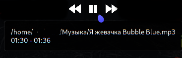
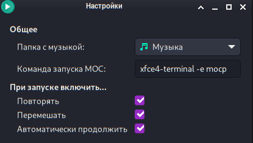
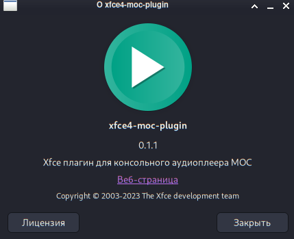

# xfce4-moc-plugin

**xfce4-moc-plugin** позволяет взаимодействовать с консольным аудиоплеером MOC через xfce-panel

### Установка

    % cd xfce4-moc-plugin
    % ./autogen.sh --prefix=/usr
    % make
    % sudo make install

## Демонстрация
 
 

### Иконка
Иконка для плагина была взята [от сюда](https://icon-icons.com/icon/Arrow-film-movie-play-player-start-video/81236)